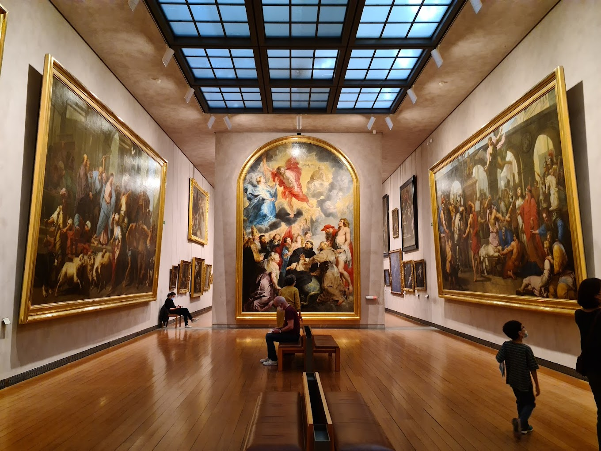

## 4 Days in Lyon 💌

Lyon is a charming city filled with history, beauty, and delicious food. I spent four wonderful days there, and every moment was a mix of adventure and relaxation. If you're planning a visit, here’s a peek into my itinerary--psst! At the end of this blog post, you'll find a summary of my trip in a digestable table format ♡

### Day 1: Exploring Vieux Lyon
On the first day, I wandered through the magical streets of **Vieux Lyon**. The old town is full of charm with its cobblestone paths and colorful Renaissance buildings. I visited the stunning **Basilica of Notre-Dame de Fourvière**, which offers a beautiful view of the city. I had lunch at a tiny restaurant that sold [sando](https://kokorocares.com/blogs/blog/sando-the-iconic-japanese-sandwich) sandwiches that I had wanted to try in a minute ! I had the smoked salmon one and my friend, the fried chicken one. It was delicious!

### Day 2: Presqu’île and Art
Day two was all about exploring the heart of Lyon. I started at **Place Bellecour**, a lively square perfect for taking a break and people-watching. Then, I visited the **Musée des Beaux-Arts**—a lovely stop for art lovers. To make the day even more fun, I rented a bike and rode around the **Presqu’île** district, discovering hidden cafés and boutiques along the way.

### Day 3: Relaxing at Parc de la Tête d'Or
After two days of exploring, I slowed down on day three at **Parc de la Tête d'Or**, a huge and peaceful park. I had a sweet little picnic by the lake, took a **boat ride**, and strolled through the park’s free zoo. It was the perfect way to unwind and enjoy nature in the middle of the city.

### Day 4: Art and History in Croix-Rousse
On my last day, I explored the artistic **Croix-Rousse** district. This area is filled with beautiful murals and hidden passageways called **traboules**. The mix of history and street art made for a lovely end to the trip, even if the steep streets were a bit of a workout!

### Final Thoughts
Lyon stole my heart with its charm and elegance. From its delicious food to its rich history, every day was a new adventure. I can’t wait to return and discover even more!

| **Day** | **Destination**    | **Activities**                                 | **Notes**                        |
|---------|--------------------|------------------------------------------------|----------------------------------|
| Day 1   | Lyon Old Town       | Explore Vieux Lyon, Visit Basilica of Notre-Dame de Fourvière | Don't forget to try local food like "quenelles" |
| Day 2   | Presqu'île District | Walk around Place Bellecour, visit Musée des Beaux-Arts | Rent a bike for easier travel |
| Day 3   | Parc de la Tête d'Or | Picnic, Boat ride on the lake, Zoo visit      | Bring snacks and water           |
| Day 4   | Croix-Rousse        | Explore the murals, Visit traboules (hidden passageways) | Wear comfortable shoes          |

