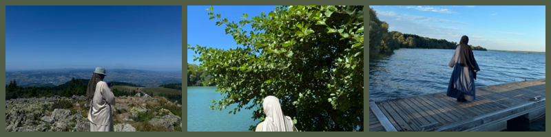

# ☾⋆｡𖦹 °✩
## À propos de moi 

## Quelques mots

Je m'appelle Amira et je suis une étudiante passionnée par les langues, les livres et la découverte de nouveaux endroits.

Small Journeys est l'endroit où je partage mon amour pour les voyages locaux, autour de la France et de ses régions voisines. Je crois en la beauté des voyages lents et réfléchis, qui permettent de s'imprégner de la culture, de découvrir des joyaux cachés et de savourer la nourriture locale.

Ce blog est un espace pour les voyageurs qui aiment les aventures simples, les expériences significatives et, bien sûr, la bonne cuisine. Qu'il s'agisse de se promener dans un village tranquille ou d'essayer un nouveau plat, je suis ravie de vous accompagner dans mon voyage.

## Comment j'aime voyager

Je crois en la beauté de ralentir et de savourer réellement le voyage. Pour moi, voyager ne consiste pas à se précipiter d'une destination à l'autre, mais à explorer le charme qui nous entoure. Qu'il s'agisse d'une ville tranquille ou d'un sentier caché, il y a toujours quelque chose de spécial à découvrir à proximité.

J'évite de prendre l'avion chaque fois que je le peux, préférant emprunter les routes pittoresques en train, en bus ou même à pied. C'est une façon plus consciente de voyager, qui me permet de me rapprocher des lieux et des personnes que je rencontre en chemin. J'ai également choisi de ne pas partager mes voyages sur les médias sociaux, car je trouve l'expérience plus enrichissante lorsqu'elle est personnelle et ininterrompue. Voyager à un rythme plus lent m'aide à apprécier les joies simples de la route, et c'est là le cœur de mon voyage.

