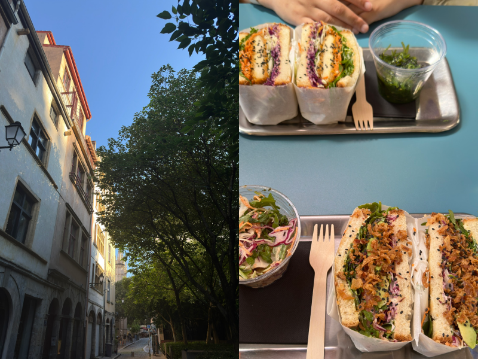
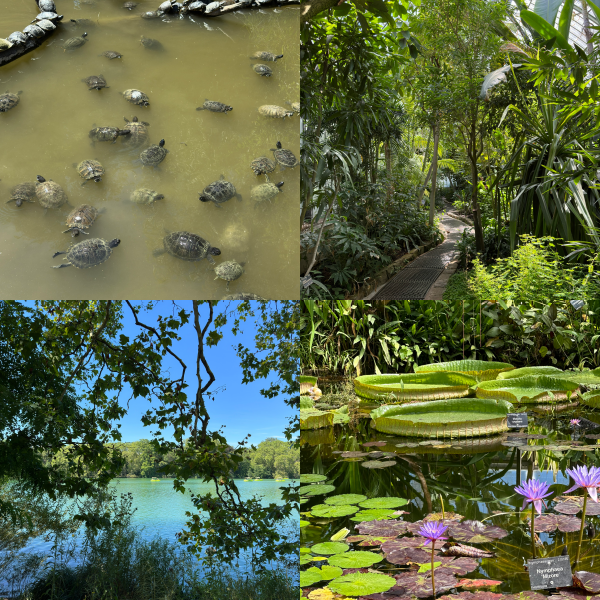

## 4 jours à Lyon 💌

Lyon est une ville charmante, pleine d'histoire, de beauté et de plats délicieux. J'y ai passé quatre jours merveilleux, où chaque instant a été un mélange d'aventure et de détente. Si vous prévoyez une visite, voici un aperçu de mon itinéraire -psst ! A la fin de ce billet, vous trouverez un résumé de mon voyage sous forme de tableau digeste ♡.

### Jour 1 : Explorer le Vieux Lyon
Le premier jour, je me suis promenée dans les rues magiques du **Vieux Lyon**. La vieille ville est pleine de charme avec ses chemins pavés et ses bâtiments colorés de la Renaissance. J'ai visité l'étonnante **basilique Notre-Dame de Fourvière**, qui offre une belle vue sur la ville. J'ai déjeuné dans un minuscule restaurant qui vendait [des sandwichs sando](https://kokorocares.com/blogs/blog/sando-the-iconic-japanese-sandwich) que je voulais essayer depuis une minute ! J'ai pris celui au saumon fumé et mon ami celui au poulet frit. C'était délicieux !

### Jour 2 : La Presqu'île et l'art
Le deuxième jour a été consacré à la découverte du cœur de Lyon. J'ai commencé par la **place Bellecour**, une place animée idéale pour faire une pause et observer les gens. Ensuite, j'ai visité le **musée des Beaux-Arts**, une belle étape pour les amateurs d'art. Pour rendre la journée encore plus amusante, j'ai loué un vélo et je me suis promenée dans le quartier de la **Presqu'île**, découvrant au passage des cafés et des boutiques cachés.

### Troisième jour : Se détendre au Parc de la Tête d'Or
Après deux jours d'exploration, j'ai ralenti le troisième jour au **Parc de la Tête d'Or**, un parc immense et paisible. J'ai fait un petit pique-nique au bord du lac, j'ai fait un **tour** en bateau et je me suis promenée dans le zoo gratuit du parc. C'était le moyen idéal de se détendre et de profiter de la nature en pleine ville.

### Jour 4 : L'art et l'histoire à la Croix-Rousse
Le dernier jour, j'ai exploré le quartier artistique de la Croix-Rousse. Ce quartier est rempli de belles peintures murales et de passages cachés appelés traboules. Le mélange d'histoire et d'art de rue a permis de terminer le voyage en beauté, même si les rues escarpées ont été un peu éprouvantes !

### Réflexions finales
Lyon m'a séduit par son charme et son élégance. De sa cuisine délicieuse à sa riche histoire, chaque jour était une nouvelle aventure. J'ai hâte d'y retourner pour en découvrir encore plus !

| **Day** | **Destination**    | **Activities**                                 | **Notes**                        |
|---------|--------------------|------------------------------------------------|----------------------------------|
| Jour 1   | Vieux Lyon       | Visiter la Basilique Notre-Dame de Fourvière | N'oubliez pas de goûter à la cuisine locale comme les "quenelles" |
| Jour 2   | Quartier de la Presqu'île | Promenade sur la Place Bellecour, visite du Musée des Beaux-Arts | Louer un vélo |
| Jour 3   | Parc de la Tête d'Or | Pique-nique, promenade en bateau sur le lac, visite du zoo      | Prévoir des en-cas et de l'eau           |
| Jour 4   | Croix-Rousse        | Explorer les fresques murales, visiter les traboules (passages cachés) | Porter des chaussures confortables          |

